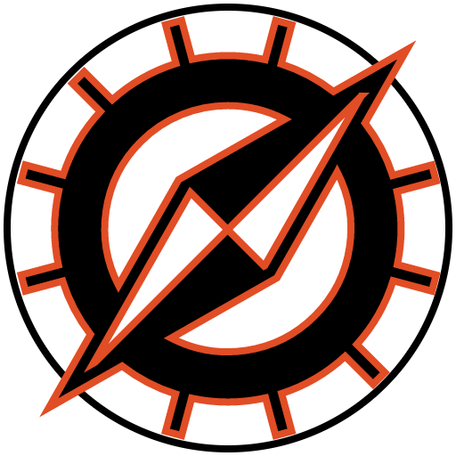
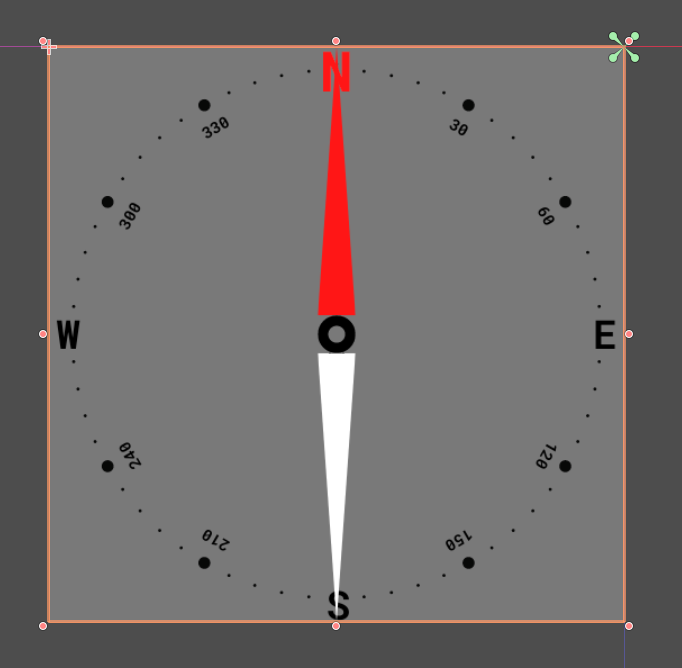
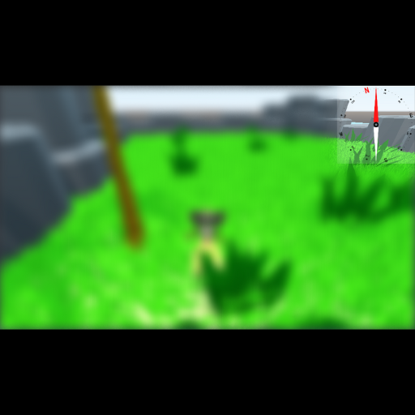
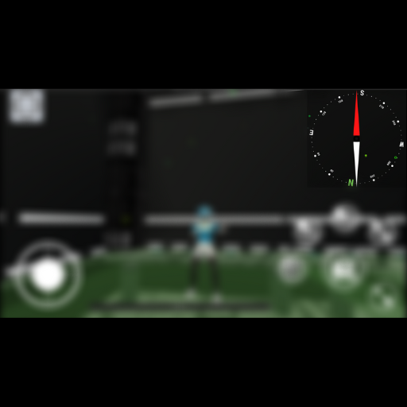

# Compass
#### Version 1.1.0
<p align="center">
  
</p>

## Table of Contents
1. [Installation](#installation)
2. [Usage](#usage)
3. [Documentation](#documentation)
4. [Examples](#examples)

## Installation
1. Create a folder called ```addons``` in your project
2. Get the plugin from the AssetLib or from GitHub.
   - Godot AssetLib: Open the AssetLib from the Godot editor and search for ```Compass```. Click download to install the plugin.
   - GitLab: Run ```git clone git@gitlab.com:gamedevone1/godot-asset-library-tools/-/tree/Compass-v1.0.0.git``` and copy the contents of the addons directory to your project's ```addons``` folder.

## Usage
1. Place the ```Compass/Source/Compass.tscn``` into your scene of choice. 
   1. The Compass Control Node will appear in the 2d section of your editor
2. Textures for the Needle and Dial are required for the Compass to work correctly. See [Documentation](#documentation) for more info.

## Documentation

**Extends:** [Control](https://docs.godotengine.org/en/stable/classes/class_control.html)

## Description

Displays the cardinal directions in a 3D space.
(North, South, East and West)

Textures for Needle and Dial are provided in ```addon/Compass/Assets/```.
Best resolution for custom textures are 512x512.

Camera Node is the primary camera used to view the 3d space.

**Note**: Advanced Settings are options that may require a more restrictive project layout
to utilize effectively. Use with caution.

## Property
| Type          | Name                      | Default Value           |
| ------------- | ------------------------- | ----------------------- |
| Color         | Background Color          | ```Color(1,1,1,0.25)``` |
| Texture       | Dial Texture              | ```null```              |
| Texture       | Needle Texture            | ```null```              |
| bool          | Advanced Settings Enabled | ```false```             |
| float         | True North                | ```0.0```               |
| NodePath      | Camera Path               | ```""```                |

## Property Descriptions

### Background Color

```gdscript
export var BackgroundColor = "1,1,1,0.25"
```

Default Color of Background

### Dial Texture

```gdscript
export var DialTexture
```

Texture resource for the Ring around the Compass

### Needle Texture

```gdscript
export var NeedleTexture
```

Texture resource for the Needle that points the direction the Camera is facing

### Advanced Settings Enabled

```gdscript
export var AdvancedSettingsEnabled = false
```

Enable to view Advance Settings in Inspector

### True North

```gdscript
var TrueNorth: float = 0
```

The degree offset of the North direction.

### Camera Path

```gdscript
var CameraPath: NodePath = ""
```

Override path to the Active 3D Camera

## Examples


